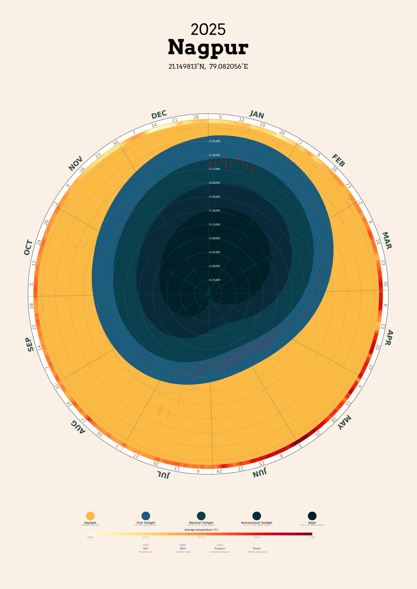

# Circular Calendar Visualization

A Python-based visualization tool that generates beautiful circular calendars showing daylight patterns, temperature data, precipitation, and optional Strava fitness tracking throughout the year. Perfect for visualizing annual patterns and creating unique wall art or desktop wallpapers.



## Features

- **Multiple Calendar Types**:
  - **Dawn Calendar**: Visualizes sunrise, twilight phases, temperature and rain data
  - **Day Calendar**: Shows complete day/night cycle with temperature and precipitation
  - **Fitness Calendar**: Integrates Strava activities with dawn/temperature data
  - **Wallpaper Calendar**: Creates desktop wallpapers with rotating current month at top

- **Rich Data Visualization**:
  - Precise sunrise, sunset, and twilight timings
  - Twilight phases visualization (civil, nautical, astronomical)
  - Annual temperature patterns with color gradients
  - Daily precipitation data with intensity mapping
  - Strava activity tracking (running, walking and cumulative distances)
  - Month markers and Sunday highlights

- **Extensive Customization**:
  - Multiple pre-defined color schemes:
    - Default: Vibrant twilight colors
    - Iceland: Cool blue tones
    - Monochrome: Black and white
    - Dark mode: Perfect for desktop wallpapers
  - Configurable data layers and displays
  - Adjustable dimensions and positions
  - Custom fonts with system fallbacks

## Prerequisites

- Python 3.8 or higher
- Internet connection for weather data
- Strava account (optional, for fitness tracking)

## Installation

1. Clone the repository:
```bash
git https://github.com/tariquesani/circular-polar-calendar.git
cd circular-polar-calendar
```

2. Create and activate a virtual environment:
```bash
python -m venv .venv
source .venv/bin/activate  # On Windows: .venv\Scripts\activate
```

3. Install dependencies:
```bash
pip install -r requirements.txt
```

## Quick Start

1. Generate a basic dawn calendar:
```bash
# Generate data for your city
python generators/generator_sun_weather.py "Nagpur" 2025

# Create the calendar
python calendar_dawn.py "Nagpur"
```

2. Find your calendar in:
- PDF version: `pdf/Nagpur_Dawn.pdf`
- PNG version: `png/Nagpur_Dawn.png`

## Advanced Usage

### Calendar Types

```bash
# Basic dawn/dusk calendar
python calendar_dawn.py "City Name"

# Full day/night cycle with precipitation
python calendar_day.py "City Name"

# Fitness tracking with Strava (remember to get strava data first)
python calendar_fitness.py "City Name"

# Desktop wallpaper
python calendar_wallpaper.py "City Name"
```

### Strava Integration

1. Set up Strava API access:
   - Create an application at https://www.strava.com/settings/api
   - Note your Client ID and Secret

2. Configure credentials:
```bash
# Create .env file
echo "CLIENT_ID=your_client_id" > .env
echo "CLIENT_SECRET=your_client_secret" >> .env
```

3. Generate Strava data:
```bash
python generators/generator_strava.py
```

## Configuration

The `config.yaml` file is your control center:

```yaml
# Basic settings
city_name: "Nagpur"
smoothen: true
interval: 0.25

# Color scheme
colors:
  night: "#011F26"
  daylight: "#fbba43"
  # See Config.md for more options
```

See [`Config.md`](Config.md) for detailed configuration options and examples.

## Project Structure

```
circular-polar-calendar/
├── components/          # Core visualization components
│   ├── layer_*.py      # Individual visualization layers
│   └── base_*.py       # Base classes and utilities
├── generators/         # Data generation scripts
├── calendar_*.py      # Main entry points
├── data/              # Generated data storage
├── png/               # PNG output directory
└── pdf/               # PDF output directory
```

## Development Guide

### Creating New Layers

1. Create a new layer class:
```python
from components.layer import Layer

class NewLayer(Layer):
    def __init__(self, config):
        self.config = config

    @property
    def start_time(self): return None
    
    @property
    def end_time(self): return None

    def plot(self, ax, base):
        # Implement plotting logic
        pass

    def footer(self, fig, dims, base):
        # Implement footer if needed
        pass
```

2. Add configuration options to `config.yaml`
3. Import and use the layer in relevant calendar scripts

### Customization Tips

- Modify color schemes in `config.yaml` for different visual styles
- Adjust layer positions using offset parameters for perfect layout
- Customize fonts and text sizes in layer classes
- Create new color schemes by copying and modifying existing ones

### Adding Data Sources

1. Create a new generator in `generators/`
2. Update `DataHandler` to process new data or create your own files
3. Create a corresponding layer to visualize the data

### Ideas for additional layers
1. Moonphase layer
2. Public holidays
3. Birthdays
4. GNATT Charts

## Troubleshooting

- **Missing Data**: Ensure your city name is correctly spelled and known to the weather service
- **Strava Auth Issues**: Check your `.env` file and API credentials
- **Font Problems**: The default font (Arvo) will fall back to system fonts if unavailable

## Contributing

Contributions are welcome! Please:

1. Fork the repository
2. Create a feature branch
3. Submit a Pull Request

## License

This project is licensed under the MIT License - see the [LICENSE](LICENSE) file for details.

## Acknowledgments

- [Matplotlib](https://matplotlib.org/) for visualization
- [Astral](https://astral.readthedocs.io/) for sun calculations
- [Strava API](https://developers.strava.com/) for fitness data
- [Meteostat](https://meteostat.net/) for weather data
- Inspired by [u/imluke](https://www.reddit.com/user/imluke)'s [design](https://www.sunlightcalendar.com/design)
- Initial code from [https://github.com/vizagite/calendar]

## Support

For issues and feature requests, please use the GitHub issue tracker.